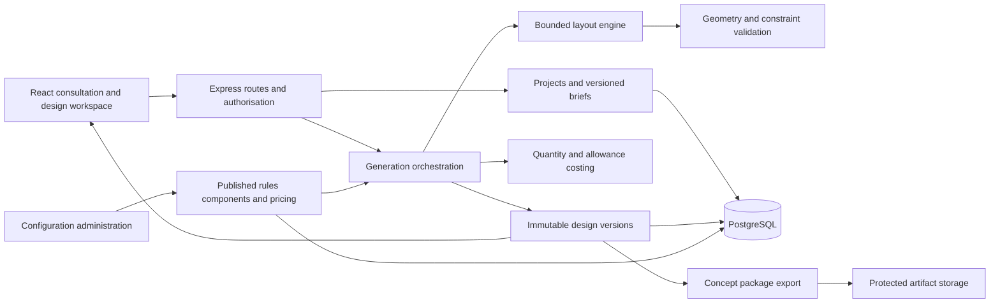
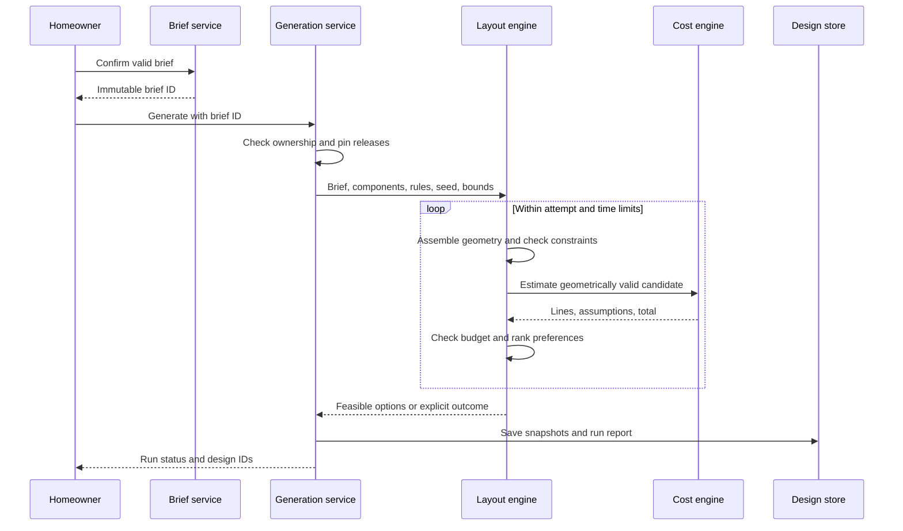

# Target System Architecture

**Status:** Proposed architecture for the revised platform. Existing modules and catalogue routes remain in the source until implementation. See [roadmap](IMPLEMENTATION_PLAN.md).

## System overview

Retain the existing React/Express/PostgreSQL foundation. Introduce project, consultation, brief, generation, design, validation, visualisation, and export responsibilities. Rendering and costing use one canonical design representation. The initial 3D library and export renderer will be selected after a prototype.

## Module responsibilities

| Module | Responsibility | Boundary |
|---|---|---|
| auth | Sessions and role checks | Reuse current foundations; enforce project ownership in each resource service. |
| projects | Owned design workspaces | No generation mathematics. |
| consultation/briefs | Conditional answers, support classification, confirmation, revisions | Must not silently convert unknown facts into verified facts. |
| generation | Pin configurations, run bounded search, persist outcomes | Does not bypass validation or overwrite saved designs. |
| geometry/validation | Buildable envelope, overlap, dimensions, circulation, requirement checks | Pure functions with no database or HTTP dependence. |
| designs | Immutable geometry/specification snapshots and comparisons | Every view resolves a specific version. |
| cost | Quantities, rates, allowances, inclusions, exclusions, contingency | Uses pinned pricing; does not confuse the existing percentage split with measured quantities. |
| visualisation | Floor plan and 3D projections of canonical geometry | No independent invented layout. |
| exports | Brief, views, plan, estimate, manifest | Access controlled; must not mix versions. |
| admin/configuration | Publish validated rule, component, style, and pricing releases | Published configurations are immutable. |

Controllers translate HTTP requests; services orchestrate and authorise; repositories execute parameterised SQL; pure engines calculate. Cross-module calls should use explicit public interfaces. The current `recommendation` and `plans` modules remain legacy catalogue functionality until migration decisions are implemented.

## Shared design contract

A design snapshot contains `schemaVersion`, `designId`, `projectId`, `briefId`, generator version and seed, rule/component/pricing release IDs, site geometry, local coordinate frame, rooms, walls, openings, roof parameters, supported finishes, requirement satisfaction results, validation report, and calculation inputs. Geometry uses metres in a documented local origin; north orientation is a separate value that may be unknown.

Rooms use stable IDs and polygons (initially rectangles); walls and openings have explicit hosts and dimensions. Store both internal usable area and gross footprint/floor area with distinct definitions. Costing uses the relevant documented area or quantity rather than assuming all room areas sum to gross construction area. Compare/round using configured tolerances; display rounding must not determine feasibility.

Doors must connect supported spaces and satisfy configured widths/clearances. Connectivity requires a graph traversal from the entrance; non-overlapping rooms alone do not demonstrate access. Privacy and appearance checks are limited to explicitly implemented rules.

## Generation lifecycle

Run states: queued -> running -> completed, no_feasible_option, exhausted, or failed. A terminal `exhausted` outcome means the bounded search did not establish a solution. Operational failures are distinguished from design conflicts. Progress polling is sufficient initially; a separate worker/queue is optional if benchmarks justify it. CPU work must be bounded and arranged so normal HTTP requests remain responsive.

## Consistency and security

Save a design with its validation and estimate atomically. If required pricing is missing, do not mark the design feasible. Confirmed briefs and published releases are immutable; edits create new versions. Exports include a manifest of version IDs and geometry checksum. Regenerating visual assets reads the saved geometry, not a fresh generation request.

JWT cookie authentication and role checks already exist. New services must check ownership even when a child ID is supplied directly. Stored downloads require the same protection. Bound input size, search complexity, and export work. If uploads are later introduced, define a separate validated upload contract rather than assuming arbitrary files are trusted.

## Migration boundaries

The current cost module estimates `floor area * finish rate`, with fixed percentage categories and contingency included in that total. The target estimator uses explicit quantity/area/allowance lines and separately documented contingency. These are different calculation models and must be versioned. Existing saved catalogue plans cannot be relabelled generated designs because they do not have canonical room geometry or confirmed briefs.
