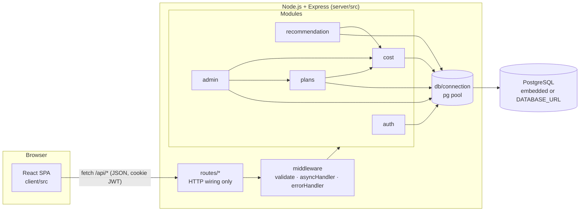
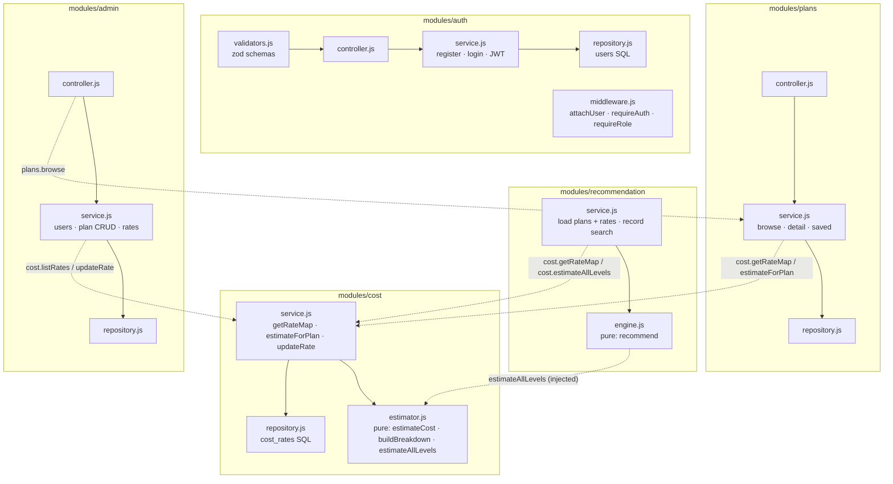
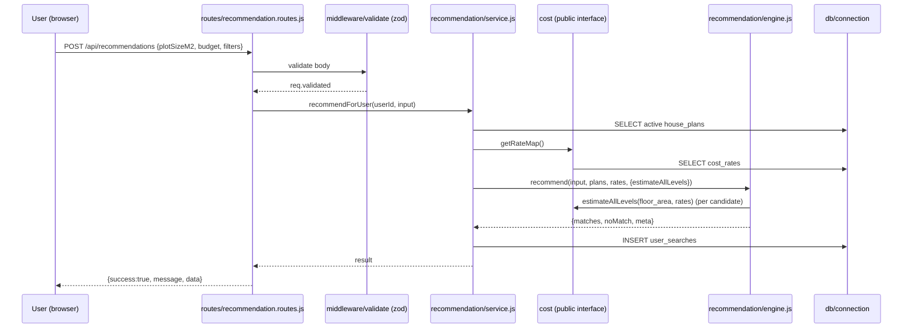

# Architecture

Smart House Design & Cost Recommendation System — FivePlusOne Devs (CSC 312)

The system is a layered, modular client–server application. Each server module owns its own data access and business rules and exposes a small public interface (`index.js`). Modules call each other only through those interfaces — never by reaching into internal files.

## System overview



## Module diagram (server)



Dotted arrows are the only cross-module dependencies, and each goes through the target module's `index.js`.

## Request flow (example: Find my house)



## Layers

| Layer | Location | Responsibility | Must not |
|---|---|---|---|
| Presentation | `client/src/pages`, `components` | Render, validate inputs for instant feedback, show loading/empty/error states | Contain pricing or matching rules |
| API client | `client/src/services` | One fetch wrapper (`api.js`) + one file per resource | Know about React state |
| Routes | `server/src/routes` | Map URLs to validators, auth guards and controllers | Contain business logic |
| Controllers | `modules/*/controller.js` | Translate HTTP ↔ service calls, set cookies, pick status codes | Run SQL |
| Services | `modules/*/service.js` | Business rules, orchestration, authorisation details | Build HTTP responses |
| Pure engines | `cost/estimator.js`, `recommendation/engine.js` | Deterministic calculations, fully unit-tested without a database | Perform I/O |
| Repositories | `modules/*/repository.js` | Parameterised SQL only | Contain rules |
| DB | `server/src/db` | Pool, schema, seed, embedded-Postgres bootstrap | Be imported by the client |

## Cross-cutting concerns

- **Response envelope**: every endpoint returns `{ success, message, data }` (`utils/response.js`). All thrown errors are translated by `middleware/errorHandler.js` into the same shape with friendly, non-technical messages; stack traces are logged server-side only.
- **Validation**: zod schemas on the server (`validators.js` per module) and mirrored plain-JS checks on the client (`client/src/utils/validation.js`). Strings are trimmed, emails lower-cased, numbers coerced and bounded.
- **Auth**: bcrypt password hashes; JWT in an `httpOnly`, `SameSite=Lax` cookie; `attachUser` runs on every request, `requireAuth` / `requireRole('admin')` guard routes. Login/register are rate-limited.
- **Security headers**: helmet, CORS restricted to the client origin, JSON body limit 100 kB, no `x-powered-by`.
- **Config/secrets**: `server/src/config.js` reads environment variables only (`.env` locally). `JWT_SECRET` is mandatory in production.
- **Database bootstrap**: `db/init.js` applies `schema.sql` on every start (idempotent) and `seed.sql` once (when `users` is empty). Without `DATABASE_URL`, `db/embedded.js` starts a real PostgreSQL from the `embedded-postgres` package so the app runs with one command on any machine.
- **i18n-readiness**: every UI string lives in `client/src/constants/strings.js`; money/area formatting goes through `Intl.NumberFormat('en-ZA')` in `client/src/utils/format.js`.

## Client structure

```
client/src
├── App.jsx                 routes + providers
├── constants/              strings.js (all copy), config.js (presets, keys)
├── context/                AuthContext, ToastContext
├── hooks/                  useFetch, useLastSearch, useSavePlan, useDocumentTitle
├── services/               api.js + auth/plans/recommendation/admin services
├── components/
│   ├── layout/             AppLayout, TopNav, BottomTabs, Breadcrumbs, PageHeader, HelpDrawer
│   ├── ui/                 Button, FormField, Modal, ConfirmDialog, Toast, Spinner, EmptyState, Banner, Tooltip, Icon
│   ├── plans/              PlanCard, PlanImage, MatchBadge, CostBreakdown
│   └── forms/              FindHouseForm, PlanForm
├── pages/                  Login, Register, Dashboard, Recommendations, PlanDetail, Browse, SavedPlans, NotFound, admin/*
├── styles/                 tokens.css (design tokens), global.css, components.css, pages.css
└── utils/                  format.js, validation.js
```

## Extending the system

- **New rule in the recommendation** → change `engine.js` and add a Jest case in `server/tests/recommendation.test.js`; nothing else needs to know.
- **New cost component** (e.g. VAT) → extend `BREAKDOWN_SHARES` in `estimator.js`; the client's breakdown list reads keys from the response.
- **New resource** → create `modules/<name>/{repository,service,controller,validators,index}.js`, mount a router in `routes/index.js`, add a service file in `client/src/services`.
- **Different database host** → set `DATABASE_URL`; no code changes.
