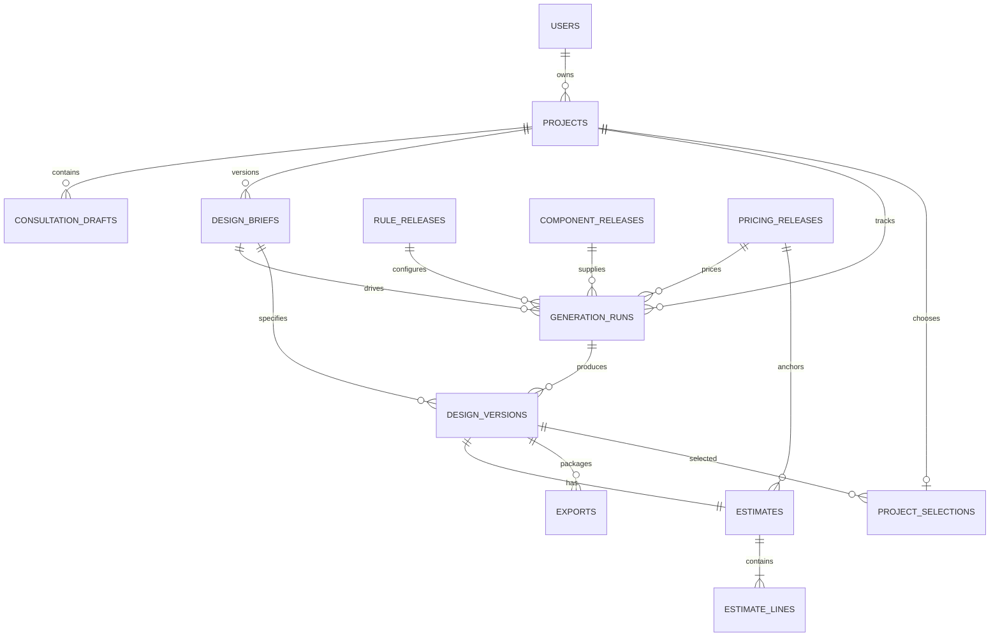

# Target Entity-Relationship Design

**Status:** Proposed PostgreSQL model; no migration has been applied. The current executable schema remains [schema.sql](../server/src/db/schema.sql), with `users`, `house_plans`, `cost_rates`, `user_searches`, and `saved_plans`.

## Proposed relationships

The estimate relationship describes complete, feasible saved options. Invalid intermediate candidates remain transient generation data, not downloadable designs.

## Entity dictionary

| Entity | Proposed fields and constraints |
|---|---|
| users | Existing identity, unique email, password hash, role, active status, timestamps. Retain existing account IDs. |
| projects | ID, owner FK, title, active/archive state, timestamps. Every project has one owner. |
| consultation_drafts | ID, project FK, questionnaire version, revision token, answers JSONB, updated timestamp. Validate against questionnaire schema; optimistic concurrency prevents lost edits. |
| design_briefs | ID, project FK, version number, normalised brief JSONB, assumptions, support classifications, confirmation timestamp. Unique `(project_id, version)`; confirmed content immutable. |
| rule_releases | ID, version, published rule JSONB, schema version, author FK, publication timestamp. Immutable after publication; includes units and tolerance definitions. |
| component_releases | ID, version, component/style/roof definitions JSONB, schema version, author FK, publication timestamp. Published definitions retain stable component IDs. |
| pricing_releases | ID, version, context, currency, effective date, rates JSONB, assumptions/exclusions, author FK, publication timestamp. Rates include units and calculation basis. |
| generation_runs | ID, project/brief FKs, pinned release FKs, generator version, seed, request key, bounds, status, diagnostics, started/finished timestamps. Request key unique within project to support safe retry. |
| design_versions | ID, project/brief/run FKs, project version number, geometry JSONB, specification JSONB, validation JSONB, geometry checksum, schema version, created timestamp. Unique `(project_id, version)`; immutable. |
| estimates | ID, unique design FK, pricing release FK, budget snapshot, currency, subtotal, contingency basis/rate/amount, total, assumptions, exclusions. Complete lines reproduce total. |
| estimate_lines | ID, estimate FK, category, calculation basis, quantity, unit, rate, amount, source reference, inclusion status. Use decimal money; no duplicate category counting. |
| project_selections | Project FK as PK, design FK, selected timestamp. Selected design must belong to that project; changing selection does not mutate geometry. |
| exports | ID, design FK, status, protected artifact key, manifest JSONB, failure code, creation timestamp. Manifest identifies brief, geometry, configuration, and estimate versions. |

## Integrity and ownership

All child resources inherit ownership from `projects.owner_id`. Validate ownership in the service for reads and writes, including exports. Database constraints should enforce that a run's brief, a design's brief/run, and a selected design belong to the same project, using composite unique keys and foreign keys where applicable; an ordinary ID FK alone does not establish this invariant.

Published releases cannot be deleted while referenced. Confirmed briefs and design snapshots are retained while their project is retained. Project archival is the initial removal behaviour; hard deletion and retention policy require an explicit design decision. User deactivation preserves their history.

Use NUMERIC or integer minor units for money and defined rounding rules. Currency must be consistent across budget and estimate. Geometry values must be finite, positive where required, schema validated, and interpreted with a stored coordinate convention. JSONB is proposed for variable geometry and versioned questionnaires, not a substitute for validation.

## Indexes and transactions

Index project owner/time, brief project/version, run project/status/time, design project/version, estimate-line estimate, and export design/time. Save each feasible design, estimate, and lines in one transaction. Use a transaction/concurrency check for brief confirmation and selection changes. Generation outcomes must not partially publish incomplete designs.

## Existing-to-target mapping

| Current table | Migration treatment |
|---|---|
| users | Reuse after verifying permissions and account behaviour. |
| house_plans | Preserve as legacy reference catalogue until migration is agreed; these are not generated geometry. |
| cost_rates | Can seed explicitly labelled demo pricing; no verified market context or quantity rules may be inferred. |
| user_searches | Retain as historical searches; not equivalent to architectural briefs. |
| saved_plans | Retain as catalogue bookmarks; do not silently convert into owned design versions. |

Implement additive, versioned migrations with a backup and rollback strategy. Existing bootstrap SQL uses `CREATE TABLE IF NOT EXISTS`; it does not perform a complete schema migration. Do not reset the database to implement this document.
