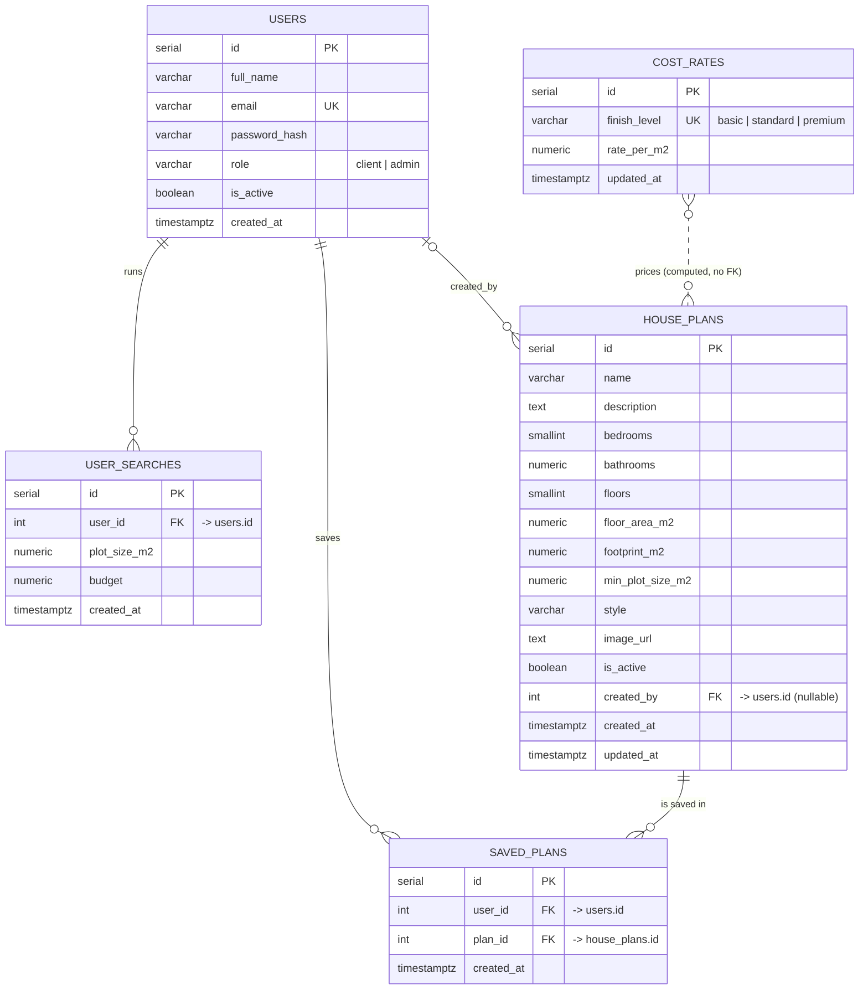

# Entity-Relationship Design

Smart House Design & Cost Recommendation System — FivePlusOne Devs (CSC 312)

Database: PostgreSQL. Schema lives in [`server/src/db/schema.sql`](../server/src/db/schema.sql); demo data in [`server/src/db/seed.sql`](../server/src/db/seed.sql).

## Diagram

## Entities

### users
Registered people. `role` decides what they may do (`client` or `admin`).

| Column | Type | Constraints |
|---|---|---|
| id | SERIAL | **PK** |
| full_name | VARCHAR(120) | NOT NULL |
| email | VARCHAR(254) | NOT NULL, **UNIQUE** (stored lower-case) |
| password_hash | VARCHAR(255) | NOT NULL (bcrypt, cost 10) |
| role | VARCHAR(10) | NOT NULL, CHECK IN ('client','admin'), default 'client' |
| is_active | BOOLEAN | NOT NULL, default TRUE (admins "deactivate" instead of deleting) |
| created_at | TIMESTAMPTZ | NOT NULL, default NOW() |

### house_plans
The catalogue of designs that can be recommended.

| Column | Type | Constraints |
|---|---|---|
| id | SERIAL | **PK** |
| name | VARCHAR(120) | NOT NULL |
| description | TEXT | NOT NULL, default '' |
| bedrooms | SMALLINT | NOT NULL, 0–20 |
| bathrooms | NUMERIC(3,1) | NOT NULL, ≥ 0 (halves allowed) |
| floors | SMALLINT | NOT NULL, 1–5 |
| floor_area_m2 | NUMERIC(8,2) | NOT NULL, > 0 — total built area (all floors) |
| footprint_m2 | NUMERIC(8,2) | NOT NULL, > 0 — ground area the house occupies |
| min_plot_size_m2 | NUMERIC(8,2) | NOT NULL, > 0 |
| style | VARCHAR(60) | NOT NULL |
| image_url | TEXT | NOT NULL, default '' |
| is_active | BOOLEAN | NOT NULL, default TRUE (hidden plans are never recommended) |
| created_by | INTEGER | **FK → users.id**, ON DELETE SET NULL |
| created_at / updated_at | TIMESTAMPTZ | NOT NULL |

Indexes: `is_active`, `bedrooms`.

### cost_rates
One row per finish level. Rates are Rand per m² of floor area.

| Column | Type | Constraints |
|---|---|---|
| id | SERIAL | **PK** |
| finish_level | VARCHAR(10) | NOT NULL, **UNIQUE**, CHECK IN ('basic','standard','premium') |
| rate_per_m2 | NUMERIC(10,2) | NOT NULL, > 0 |
| updated_at | TIMESTAMPTZ | NOT NULL |

### user_searches
History of "Find my house" searches, used to prefill the form next time and for admin statistics.

| Column | Type | Constraints |
|---|---|---|
| id | SERIAL | **PK** |
| user_id | INTEGER | NOT NULL, **FK → users.id**, ON DELETE CASCADE |
| plot_size_m2 | NUMERIC(10,2) | NOT NULL, > 0 |
| budget | NUMERIC(14,2) | NOT NULL, > 0 |
| created_at | TIMESTAMPTZ | NOT NULL |

Index: `(user_id, created_at DESC)` for the "last search" lookup.

### saved_plans
Associative entity resolving the many-to-many between users and house plans.

| Column | Type | Constraints |
|---|---|---|
| id | SERIAL | **PK** |
| user_id | INTEGER | NOT NULL, **FK → users.id**, ON DELETE CASCADE |
| plan_id | INTEGER | NOT NULL, **FK → house_plans.id**, ON DELETE CASCADE |
| created_at | TIMESTAMPTZ | NOT NULL |
| | | **UNIQUE (user_id, plan_id)** — a plan can be saved once per user |

## Relationships and cardinalities

| Relationship | Cardinality | Notes |
|---|---|---|
| users → user_searches | 1 : 0..N | A user runs many searches; each search belongs to exactly one user. Deleting a user deletes their searches. |
| users → saved_plans | 1 : 0..N | A user saves many plans. |
| house_plans → saved_plans | 1 : 0..N | A plan can be saved by many users. Together with the above this is an M:N between users and house_plans. |
| users → house_plans (created_by) | 0..1 : 0..N | An admin may author many plans; a plan records at most one author. Nullable so plan history survives if the admin account is removed. |
| cost_rates ↔ house_plans | none (computed) | Estimates are calculated at request time as `floor_area_m2 × rate_per_m2`; nothing is stored, so a rate change updates every estimate immediately. |

## Design notes
- All monetary values are stored as NUMERIC (never FLOAT) and formatted as ZAR in the UI.
- `is_active` flags on users and plans implement soft deactivation; hard deletes of plans cascade to `saved_plans`.
- Every write goes through parameterised queries (`$1, $2 …`) in the module repositories.
